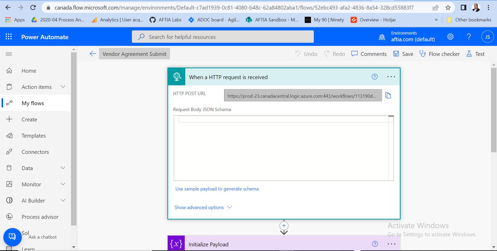
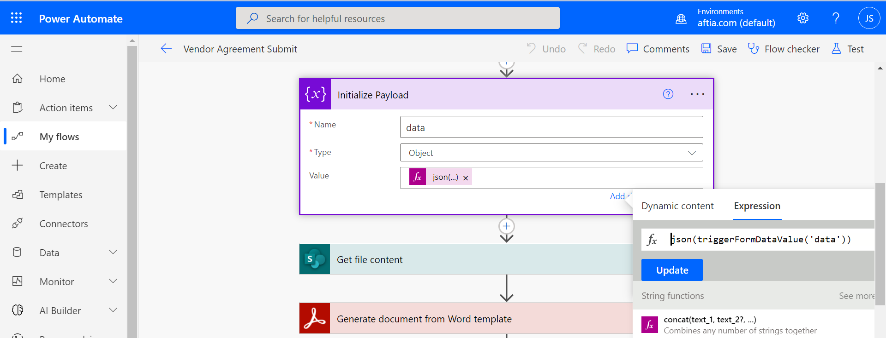

# Connecting to Power Automate

A Morf form always needs to be submitted "somewhere" where the data can be received and processed.   Morf makes it easy to submit the data, well... really anywhere, using HTTP POST.
To specify where a Morf form should submit the data, include the destination URL in the `submit` property of the `config` section of the form design.

While literally any web server or application that can accept an HTTP POST could receive the form data, it may require custom setup or programming in order to process it.
Microsoft's Power Automate is a low-code tool that can make it much simpler to receive and process the data.  With robust connectors to Adobe Acrobat Sign and Adobe PDF Services, powerful processing applications can quickly be created to generate and sign dynamic documents.
Other standard connectors in Power Automate make the integration capabilities nearly endless.

MS Power Automate processes are called 'Flows'.  In order for a Flow to execute it must be started by a 'trigger'.  Triggers can be manual, such as the click of a button, or automated, such as a request from another application.
Microsoft calls the manual triggers 'Instant Cloud Flows' and the automated ones as "Automatic Cloud Flows".   To recieve a data submission with Power Automate you'll use the "When a HTTP request is received", an automatic cloud Flow trigger.  After creating a Flow with the "When a HTTP request is received" trigger and saving it, Power Automate will populate the HTTP POST URL property.

Copy the URL found in the HTTP POST URL property and insert it into the submit property.   Also consider providing a `successUrl` which is where the browser will redirect to after a successful submission.

    {
      "config": {
        "submit": "https://prod-23.canadacentral.logic.azure.com:443/workflows/113190d411724167a63c....",
        "siteKey": "4fbfd303f2f74c6ea2ec3bc9ab44d454",
        "successUrl": "getmorf.io",
        "theme": "",
        "externalId": ""
      },
      
   Your next step in the Flow, should initialize a varible and store the data submission in JSON format so it can be read and used during the processing of the Flow.
   To do this, use the initial variable step.  Give your variable a name, such as data, and ensure the type is set to objecct.  Then set the value using the expression `json(triggerFormDataValue('data'))`, where data is the name of your variable.  
   The JSON object you have just created will contain the data from the fields that have a bind value specified in the form.   This object can be used by other steps in your Flow. 
   
   
